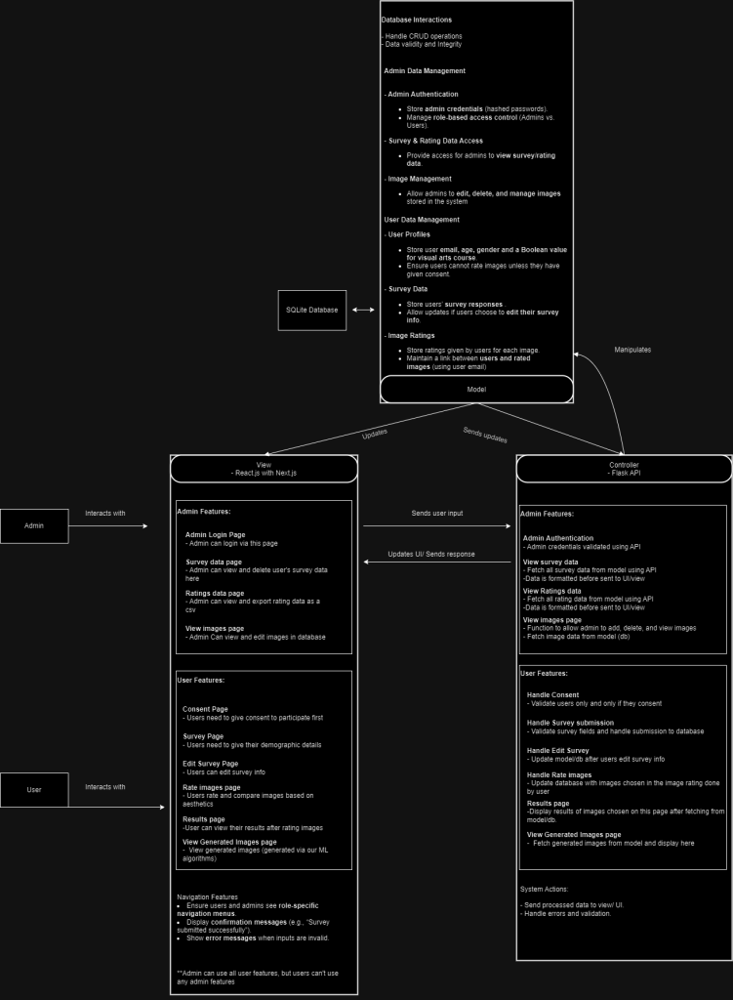
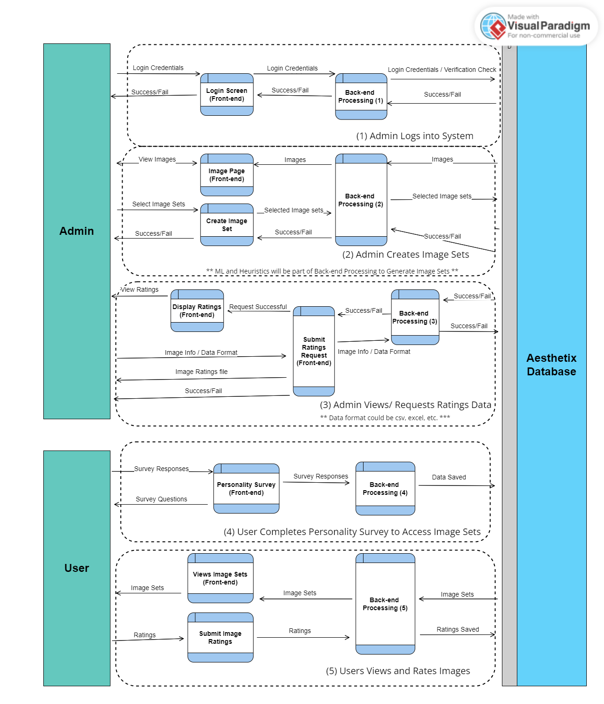

# Image Aesthetics System — COSC 499-003 Team 9 Final Project

**Built by**: [**Samira Almuallim**](https://github.com/almsam), [**Devstutya Pandey**](https://github.com/Devstutya), [**Saketh Anand**](https://github.com/saku1127), & [**Shakthi Vel**](https://github.com/memegamer138)

---

## Demo: [Video Walkthrough of our system](https://www.youtube.com/watch?v=Hu2tjA3ScWY )

---

## Overview
The **Aesthetix** is a web-based platform designed to collect and analyze user feedback on image aesthetics. It helps improve an image selection algorithm by learning from user preferences.

There are two types of users:
- **General Users:** Participate in image rating surveys and view personal results via a user dashboard.
- **Administrators:** Manage surveys, view aggregate results, and analyze aesthetic feedback.

---

## System Architecture:

### Tech Stack
| Component  | Technology |
|------------|------------|
| Frontend   | Next.js (React) |
| Backend    | Flask (Python) |
| Database   | SQLite (or any relational DB) |
| Containerization | Docker |

The system is fully containerized using Docker to ensure smooth deployment across environments.

### Components
- **Frontend:**  
  An interactive user interface for both survey participants and admins. Includes image ratings, dashboards, and visualizations.

- **Backend:**  
  Flask APIs handle survey submission, image processing, and data storage. Designed modularly using blueprints for scalability.

- **Database:**  
  Stores all survey responses, demographic information, and admin configurations.

- **Containerization:**  
  Each component is containerized for portability and isolation. A reverse proxy (e.g., Nginx) can be added for production environments.


#### System Architecture Diagram

This system we have built uses the Model-View-Controller (MVC) architecture to manage the web application.

---

## 1. Model (Data & Logic Layer)

Handles all core functionality and database interactions using SQLite:

- **Data Management**: CRUD operations, data validation, and integrity.
- **User Profiles**: Stores demographic info and consent status.
- **Surveys & Ratings**: Manages survey responses and image ratings linked by user email.
- **Admin Controls**: Manages image data, admin authentication (hashed passwords), and access control.
- **Machine Learning**: Calls an AI model to generate images based on inputs.

---

## 2. View (Frontend – React.js + Next.js)

The UI layer that interacts with users and admins:

- **User Pages**: Consent form, demographic survey, image rating, results, and generated images.
- **Admin Pages**: Login, view/manage survey data, ratings, and stored images.
- **Navigation**: Role-based views with error handling and confirmation messages.

---

## 3. Controller (Backend – Flask API)

Serves as the communication bridge between the View and Model:

- **Admin Functions**: Validates credentials, fetches/modifies data via API.
- **User Functions**: Handles consent, survey submission/editing, image rating, and results.
- **System Actions**: Processes data, handles errors, and updates UI.

---

## User Roles

- **Admins**: Full access to data and image management.
- **Users**: Submit surveys, rate images, and view results (no admin access).

---

This architecture enables a clear separation of concerns, supports role-based functionality, and integrates AI-generated content for a dynamic, interactive experience.


#### DFD Level 1

# Data Flow Diagram Description

The data flow diagram included depicts our 3 main processes for the admins & our 2 main for the users

———————————————

The admins first dataflow shows the process of logging into the system

The second admin dataflow shows the process of adding, removing, &/or changing the image set the app is working on & the third admin dataflow shows a data analyst pulling ratings for analysis in external software

———————————————

As for the users, the first dataflow shows the demographic survey being filled out & submitted & the final dataflow shows the users rating images in the image set


---

## Features:

### Core Features

#### Application:

### Core Features

---

#### Application Logic

- **Demographic Info Collection**  
  *Built by: [Saketh](https://github.com/saku1127), [Shakthi](https://github.com/memegamer138), & [Devstutya](https://github.com/Devstutya)*  
  - Prompts users for demographic info (age, gender, name, etc.) when the app starts.  
  - Stores this data in a database for segmentation and later analysis.

- **Image Rating System**  
  *Built by: [Saketh](https://github.com/saku1127), [Shakthi](https://github.com/memegamer138), & [Devstutya](https://github.com/Devstutya)*  
  - Displays pairs of images from a directory.  
  - Users pick their preferred image from each pair.  
  - Stores the responses for:
    - Visual preference analysis.
    - Training a machine learning model to predict aesthetic appeal.

---

#### Image Aesthetics (AI/ML)

- **AI-Based Image Rating**  
  *Built by: [Samira](https://github.com/almsam)*  
  - A CNN model processes grayscale images and predicts user preferences.  
  - Outputs a float (0–1) representing the image’s aesthetic score.  
  - **Note**: Works on grayscale images; limited RGB support.  
  - **Known Bug**: Sensitive to noise and non-PNG/ndarray formats.

- **Image Generation via AI**  
  *Built by: [Samira](https://github.com/almsam)*  
  - Uses gradient ascent to generate aesthetically pleasing images from a seed.  
  - Relies on the AI-based rating model to guide improvements.  
  - Final output is a smoothed 2304x2304 PNG image.  
  - **Known Bug**: Redundant data is saved during smoothing and quality processing.

---

#### Session & Dashboard Management

- **Session Management**  
  *Built by: [Devstutya](https://github.com/Devstutya), [Shakthi](https://github.com/memegamer138)*  
  - Middleware restricts access based on login and survey completion status.  
  - Uses cookies (`admin login`, `survey completed`) to track session state.

- **User Dashboard**  
  *Built by: [Saketh](https://github.com/saku1127), [Shakthi](https://github.com/memegamer138), & [Devstutya](https://github.com/Devstutya)*  
  Includes:
  - **Edit Survey Info**: Modify survey responses (except email).
  - **Rate Images**: Access image rating page.
  - **Logout**: Ends session and resets `surveyCompleted` cookie.

- **Admin Dashboard**  
  *Built by: [Saketh](https://github.com/saku1127), [Shakthi](https://github.com/memegamer138), & [Devstutya](https://github.com/Devstutya)*  
  Includes:
  - **View Survey Data**: List of all users who completed the survey.
  - **Export Rating Data**: View/export all image rating responses.
  - **View Images**: Preview all images used in the app.

---

#### Internationalization

- **Multi-language Support**  
  *Built by: [Saketh](https://github.com/saku1127), [Shakthi](https://github.com/memegamer138), & [Devstutya](https://github.com/Devstutya)*  
  - Enables the UI to adapt to multiple languages, improving accessibility.

- **Results Page for Users**  
  *Built by: [Saketh](https://github.com/saku1127), [Shakthi](https://github.com/memegamer138), & [Devstutya](https://github.com/Devstutya)*  
  - Displays individual results after image rating is completed.  
  - Optionally includes comparisons or aesthetic insights.
--

## Evaluation & Performance

### Aesthetic Score Evaluation
- A CNN model trained on 32x32 grayscale images.
- Predicts the probability a user would prefer an image.
- Evaluated by matching the model’s prediction against actual user majority votes.
- **Performance: ~80% accuracy** (8/10 correct predictions), where random guessing would have only achieve ~50%

### Image Generation Pipeline
1. Start with a seed to generate a deterministic random image (32x32).
2. Apply Gradient Ascent to maximize the aesthetic score.
3. Clean the image:
   - Remove non-black/white pixels.
   - Apply two rounds of nearest-neighbor smoothing.
   - Interpolate up to 2304x2304 resolution


---

## Installation & Setup:

To get started with the main app:

### Prerequisites:
 - Docker Desktop (if running with Docker)
 - Python with Flask
 - Node.js & npm (if running without Docker)

### Run with Docker (Recommended):

```Bash
# 1. Clone our repo
git clone https://github.com/COSC-499-W2024/capstone-project-team-9-Order-Of-Aesthetics.git
cd capstone-project-team-9-Order-Of-Aesthetics

# 2. Build & start containers
docker-compose up --build  # run this the first time only,
docker-compose up          # always run this

# 3. Access the app
# the front end should now be avaliable here
http://localhost:3001
```


### Run without Docker (If needed):

``` Bash
# 1. Navigate to app source
cd app/src/main

# 2. Initialize backend (ensure Flask env is ready)
python init.py

# 3. Run the frontend
npm install
npm run dev

# 4. Access the app at:
http://localhost:3001

```


You can also **[click here](http://localhost:3001)** after either one for a direct link to the localhost


### Run The ML side (bonus):

If you would like to access the ML part of our project (which was left out of the main part due to performence & pre req reasons) refer to this readme file: **[ML/README.md](https://github.com/COSC-499-W2024/capstone-project-team-9-Order-Of-Aesthetics/blob/master/ml/README.md)**

---

## Directory Structure:

```
.
├──.github                  # Github Workflow CI/CD Pipeline
|   ├── playwright.yml      # Automated End 2 end Tests
|   ├── testing.yml         # Automated backend and Frontend Tests
├──.next
├── doc                    # Documentation files 
│   ├── TOC.md              # Table of contents
│   ├── plan                # Scope and Charter
│   ├── design              # All design content
│   ├── logs                # Team and individual logs
│   └── ...
├── build                   # Compiled files   
├── app                     # Source files for frontend and backend
├── test                    # Automated tests 
├── e2eTests                # Playwright end to end tests 
├── ml                      # All ML related files
├── util                    # Tools and utilities
├── LICENSE                 # The license for this project 
└── README.md
```
