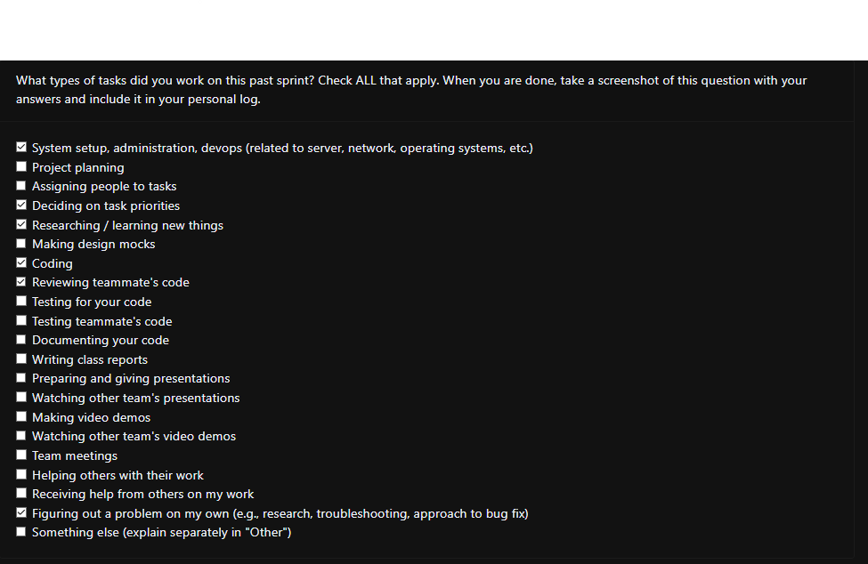

## Sunday (19th January 2025)

### Current Tasks
  * #1: User Privileges: Pages can only be accessed after survey is done
  * #2: Frontend quality of life: Implement changes requested during peer testing
### Progress Update 
<table>
    <tr>
        <td><strong>TASK/ISSUE #</strong>
        </td>
        <td><strong>STATUS</strong>
        </td>
    </tr>
    <tr>
        <!-- Task/Issue # -->
        <td>#1: User privileges.
        </td>
        <!-- Status -->
        <td>Completed
        </td>
    </tr>
    <tr>
        <!-- Task/Issue # -->
        <td>#2: Frontend quality of life changes
        <!-- Status -->
        <td>In Progress
        </td>
    </tr>
        </table>

### Cycle Goal Review (Reflection: what went well, what was done, what didn't; Retrospective: how is the process going and why?)
Unfortunately, I couldnt dedicate a lot of time to capstone work this iteration as i was packed with assignments and another preoject deadline. Additionally, deployment took a lot more time than expected and we will need to push it to nex iteration.
### Next Cycle Goals (What are you going to accomplish during the next cycle)
  * Securing and deployment
### Team Evaulation Screenshot
