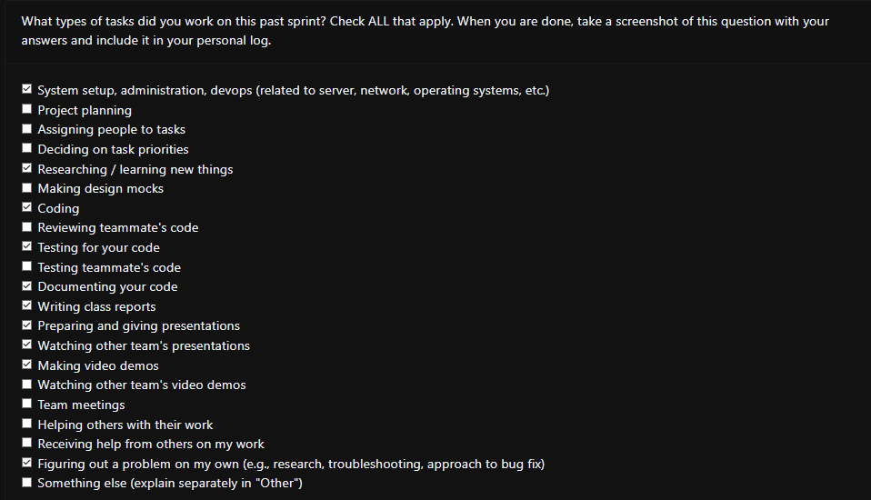

### Current Tasks
  * #1:Deployment: Deployment of project in UBC server
  * #2: Backend testing: Optimize backend tests for automated testing
### Progress Update 
<table>
    <tr>
        <td><strong>TASK/ISSUE #</strong>
        </td>
        <td><strong>STATUS</strong>
        </td>
    </tr>
    <tr>
        <!-- Task/Issue # -->
        <td>#1: Deployment
        </td>
        <!-- Status -->
        <td>Completed
        </td>
    </tr>
    <tr>
        <!-- Task/Issue # -->
        <td>#2 Backend Testing
        <!-- Status -->
        <td>Completed
        </td>
    </tr>
        </table>

### Cycle Goal Review (Reflection: what went well, what was done, what didn't; Retrospective: how is the process going and why?)
All tasks have been copmleted, and we're working on the final documentation that will be done by tonight as well. Also, we havent merge the deployment branch since it was deemed to be unecessary. The server is currently using the Certificate branch for hosting, however.
### Next Cycle Goals (What are you going to accomplish during the next cycle)
  * -
### Team Evaulation Screenshot
