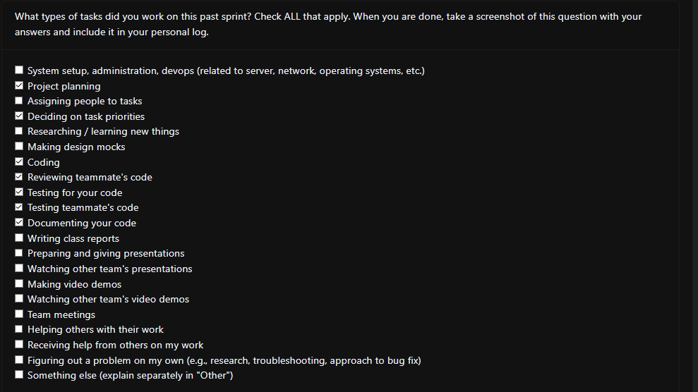

## Sunday (19th January 2025)

### Current Tasks
  * #1: Additional features for surveyAPI: Added methods to get and delete data from surveys.
  * #2: Experiment Summary: Created method to calculate percent of users who chose the same image as the primary user and send the data to frontend where it can be displayed visually.

### Progress Update 
<table>
    <tr>
        <td><strong>TASK/ISSUE #</strong>
        </td>
        <td><strong>STATUS</strong>
        </td>
    </tr>
    <tr>
        <!-- Task/Issue # -->
        <td>#1: Additional features for surveyAPI
        </td>
        <!-- Status -->
        <td>Completed
        </td>
    </tr>
    <tr>
        <!-- Task/Issue # -->
        <td>#2: Experiment Summary
        </td>
        <!-- Status -->
        <td>Completed
        </td>
    </tr>
        </table>

### Cycle Goal Review (Reflection: what went well, what was done, what didn't; Retrospective: how is the process going and why?)
Overall we had a decently productive week in my opinion. I planned on getting 3 issues done this iteration but I was sick over the winter break and the first week of January so my performance was quite restricted.
### Next Cycle Goals (What are you going to accomplish during the next cycle)
  * Update tables as some of the data is obsolete
  * General bug fixing and additional features 
### Team Evaulation Screenshot
