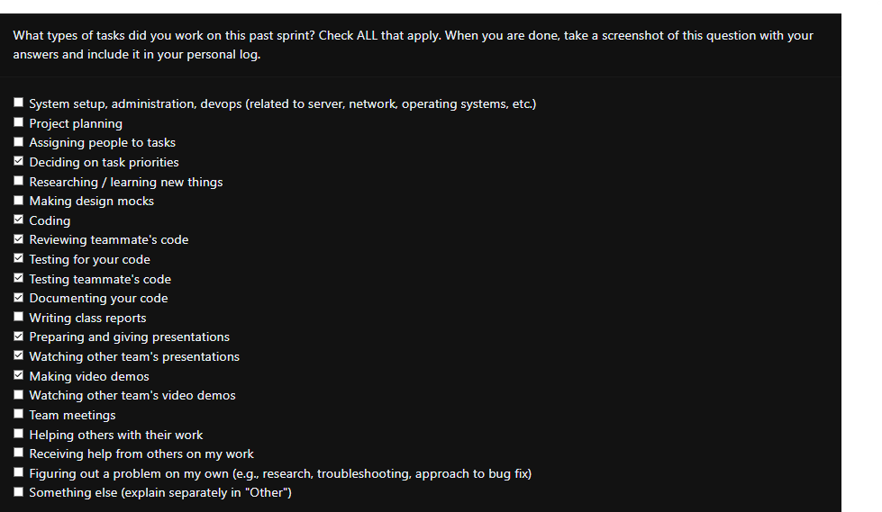

## Sunday (19th January 2025)

### Current Tasks
  * #1: Export ratings of csv: Admin should be able to export the csv of ratings data which is available on ratingdata-page
  * #2: Edit/Remove survey data: Admin should be able to remove bad survey data after viewing survey data
  * #3: Backend functionality for edit survey info: Users should be able to see their current survey info and change their info via this page. Page has been created, backend functionality needs to be added via SurveyAPI.
  * #4: Remake tables in db: Removed ratings parameter from ratings table.

### Progress Update 
<table>
    <tr>
        <td><strong>TASK/ISSUE #</strong>
        </td>
        <td><strong>STATUS</strong>
        </td>
    </tr>
    <tr>
        <!-- Task/Issue # -->
        <td>#1: Export ratings of csv
        </td>
        <!-- Status -->
        <td>Completed
        </td>
    </tr>
    <tr>
        <!-- Task/Issue # -->
        <td>#2: Edit/Remove survey data
        <!-- Status -->
        <td>Completed
        </td>
    </tr>
        <tr>
        <!-- Task/Issue # -->
        <td>#3: Backend functionality for edit survey info
        <!-- Status -->
        <td>Completed
        </td>
    </tr>
        <tr>
        <!-- Task/Issue # -->
        <td>#4: Remake tables in db
        <!-- Status -->
        <td>Completed
        </td>
    </tr>
        </table>

### Cycle Goal Review (Reflection: what went well, what was done, what didn't; Retrospective: how is the process going and why?)
This was a really productive iteration thanks to the peer testing that was done in class. We managed to get some great issues for the next iteration and got some key features and bug fixes done.
### Next Cycle Goals (What are you going to accomplish during the next cycle)
  * Add a consent form.
  * Proper Session Management
### Team Evaulation Screenshot
