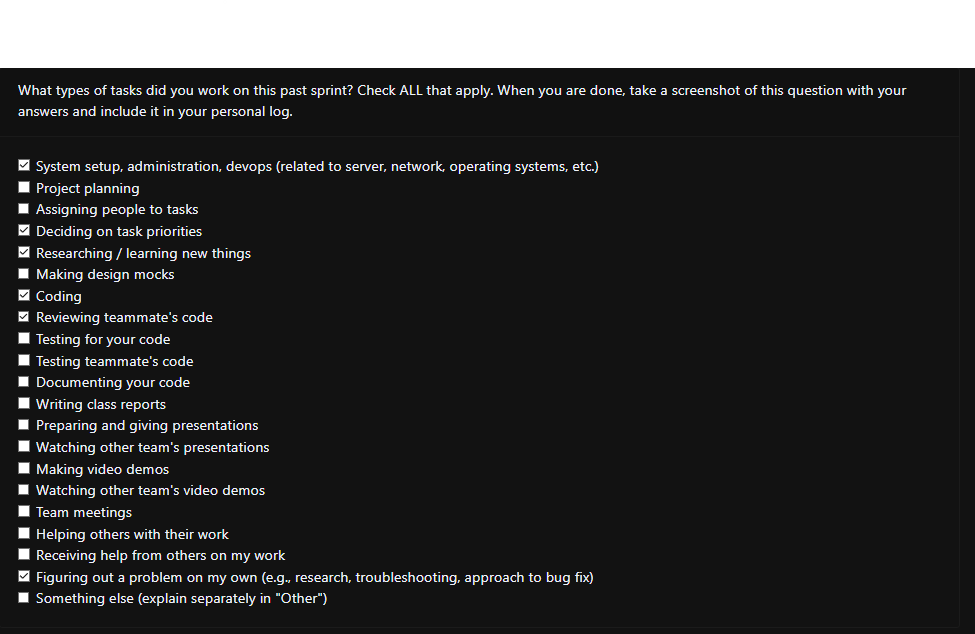

## Sunday (19th January 2025)

### Current Tasks
  * #1: Docker containers for project: Need to fix issues with docker
  * #2: Securing Project: Secure project through https by using certificates.

### Progress Update 
<table>
    <tr>
        <td><strong>TASK/ISSUE #</strong>
        </td>
        <td><strong>STATUS</strong>
        </td>
    </tr>
    <tr>
        <!-- Task/Issue # -->
        <td>#1: Docker containers for project.
        </td>
        <!-- Status -->
        <td>Completed
        </td>
    </tr>
    <tr>
        <!-- Task/Issue # -->
        <td>#2: Securing project though HTTPS
        <!-- Status -->
        <td>In Progress
        </td>
    </tr>
        </table>

### Cycle Goal Review (Reflection: what went well, what was done, what didn't; Retrospective: how is the process going and why?)
Unfortunately, I couldnt dedicate a lot of time to capstone work this iteration as i was packed with midterms and assignments. Additionally, deployment took a lot more time than expected and we will need to push it to nex iteration. But I must say fixing docker was a huge task as we were stuck on it since the beginning of capstone.
### Next Cycle Goals (What are you going to accomplish during the next cycle)
  * Proper Session Management
  * Deployment
### Team Evaulation Screenshot
