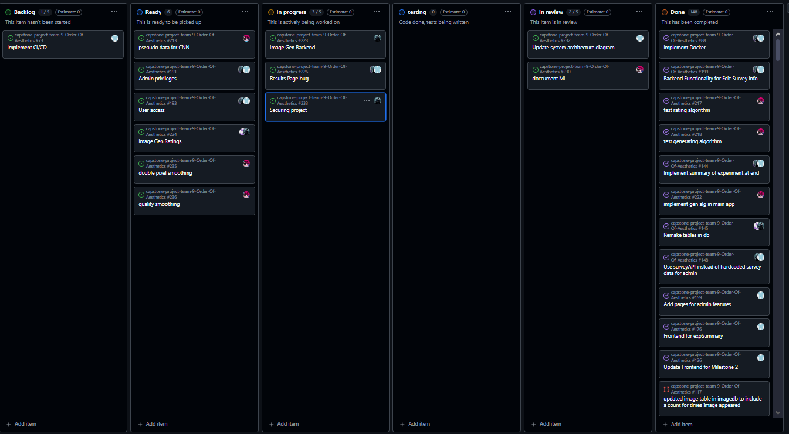
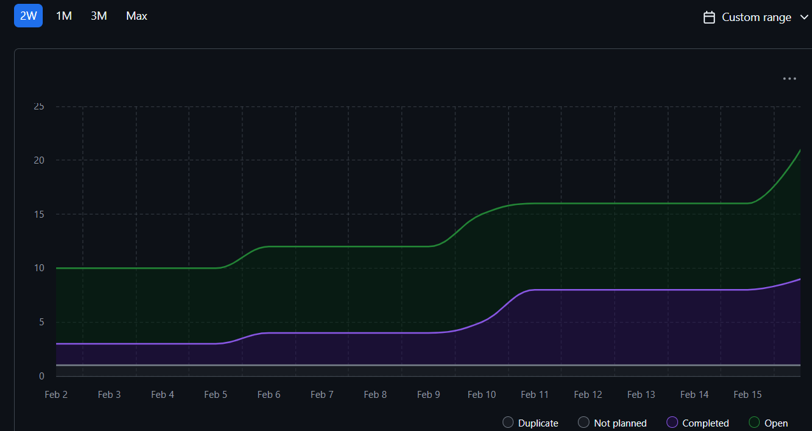

# Weekly Team Log

## Date Range:

- Week 4 - Week 4
- [2/2/2024] - [16/2/2025]

## Features in the Project Plan Cycle:

1.  Add Image generation page: Created a page in which users can see the generated images via the ML algorithm we created.
2. Add experiment summary/results page: Created a page in which users can see the results of their experiment, which images they picked, and how many users picked the same images (along with a percentage)
3. Added consent form page: Added a page where users can consent or not consent to participating after going through a pdf they havve to download.
4. Backend Functions: Various functions which allow us to fetch/insert data into the different databases have been created. Also various edit data functions have also been added to the backend functions.
5. Machine learning improvements: use a variety of mathematical & data science techniques should allow a much lower error with the CNN.
6. Improved UI and sidebar accessability: Sidebar has improved accessability. Additionally user and admin dashboard have been updated to look more appropriate. Fixed some UI bugs too.
7. [Add more here]

## Associated Tasks from Project Board:

| Task ID | Description   |Feature   | Assigned To | Status        |
| ------- | -------------------------------------------------------------------------------------- | ----------------------------------------------------------------------------------------------------------------------------------------------------------- | ----------- | ------------- |
| 214  | Image generation UI  |Add a page/UI for generated imagees to be displayed on   | [Devstutya] | [Complete]    |
| 232   | Update system architecture diagram  | Added updated system architecture diagram   | [Devstutya] | [Complete]    |
| 176    | Frontend for expSummary  | Added experiment summary page or results page for users   | [Devstutya] | [Complete]    |
| 192     | Resetting application  |  Added exit button after experiment summary which leads users back to their dashboard and added an exit button on their dashboard which will lead back to the homepage.                  | [Devstutya] | [Complete]    |
| 203   | View and Edit/Remove survey info     | Admin can now view and delete survey info on the view survey data page   | [Devstutya] | [Complete]    |
| 204    | Export Rating CSV | Admin can now export rating data to csv and view this data on ratingdata-page | [Devstutya] | [Complete]    |
| 207    | Improve sidebar button accessibility | UI and sidebar is now more appropriate and accessible | [Devstutya] | [Complete]    |
| 30      | Make a python file that expands on preview.py, so we can rate the images               | Prototype Python application                                                                                                                                | [Samira]    | [Complete]    |
| 31      | Prove that we can use neural nets this way                                             | Proof of concept CNN                                                                                                                                        | [Samira]    | [Complete]    |
| 31      | Make the app start at image i'ds other then 0                                          | Append CSV in prototype app                                                                                                                                 | [Samira]    | [Complete]    |
| 47      | Add appropriate end to end tests                                                       | End to end testing                                                                                                                                          | [Devstutya] | [Complete]    |
| 88     | Docker containers for our projects    | There are a lot of issues with docker that we need to ix and get the project dockerized.                 | [Shakthi]   | [Complete]    |
| 234     | Securing Project                                                                | We need to secure the project through HTTPS and certificates | [Shakthi]   | [In Progress]    |
| 92      | Age Restriction check                                                                  | Create a check to ensure only users who are 18+ can access the image survey                                                                                 | [Saketh]    | [Complete]    |
| 60      | Work on parameters & number of iterations to improve our CNN                           | Back End ML                                                                                                                                                 | [Samira]    | [Complete]    |
| 61      | Implement alternative pre train structures to the CNN                                  | Back End ML                                                                                                                                                 | [Samira]    | [Complete]    |
| 62      | Train test split the data to check for over-fit with too many epoch's                  | Back End ML                                                                                                                                                 | [Samira]    | [Complete]    |
| 63      | Make graphs of 60 61 & 62 to verify proper optimization                                | Back End ML                                                                                                                                                 | [Samira]    | [Complete]    |
| 193     | User access                                                                    | Experiment can only be accessed after survey is completed.                                                                                         | [Saketh]    | [In-Progress]    |
| 224     | Image Gen Ratings                                                                     |Create an API endpoint to update the backend with the Ratings for each generated image on the image gen page.                              | [Saketh]    | [In-Progress]    |
| 74      | Make a readme.md file for the app dir to keep up with new code                         | App Documentation                                                                                                                                           | [Samira]    | [Complete]    |
| 97      | ML RM                                                                                  | create a read me file                                                                                                                                       | [Samira]    | [In progress] |
| 98      | Make visualizations                                                                    | prep for other bits of data being recorded                                                                                                                  | [Samira]    | [Complete]    |
| 106     | Make data                                                                              | make data entries for surrogate modeling                                                                                                                    | [Samira]    | [Complete]    |
| 107     | Make model                                                                             | use 106 to train surrogate models                                                                                                                           | [Samira]    | [Complete]    |
| 108     | Save models                                                                            | save tensorflow models to be more deterministic                                                                                                             | [Samira]    | [Complete]    |
| 127     | Make a testing framework to gather data from each target group - see data directory    | test framework                                                                                                                                              | [Samira]    | [Complete]    |
| 128     | Run the tests & gather the data from people                                            | run tests                                                                                                                                                   | [Samira]    | [Complete]    |
| 129     | document how the neural net works - existing rm is inadequate/out of date              | NN documentation                                                                                                                                            | [Samira]    | [Complete]    |
| 130     | study the data from issue 128                                                          | analysis & visualization                                                                                                                                    | [Samira]    | [Complete]    |
| 131     | make & document questions for the client                                               | client questions                                                                                                                                            | [Samira]    | [Complete]    |
| 199     | Backend Functionality for Edit Survey Info                                             | backend                                                                                                                                                     | [Saketh]    | [Complete]    |
| 203     | Edit/Remove Survey Data                                                                | backend                                                                                                                                                     | [Saketh]    | [Complete]    |
| 205     | Image Aspect                                                                           | frontend                                                                                                                                                    | [Saketh]    | [Complete]    |
| 226      | Results Page bug                                                                       | backend/frontend                                                                                                                                            | [Saketh]    | [In-Progress] |
| 149     | image quality                                                                          | backend ML                                                                                                                                                  |             |               |
| 150     | fix data analysis                                                                      | ML experiment                                                                                                                                               |             |               |
| 164     | new images from PDF                                                                    | ML                                                                                                                                                          |             |               |
| 165     | restructure                                                                            | repo fix                                                                                                                                                    |             |               |
| 181     | VAST training data                                                                     | ML - data                                                                                                                                                   | [Samira]    | [Complete]    |
| 184     | read CNN                                                                               | ML - development                                                                                                                                            | [Samira]    | [Complete]    |
| 187     | image Gen                                                                              | ML - new feature                                                                                                                                            | [Samira]    | [Complete]    |
| 195     | seed for image gen                                                                     | ML - development                                                                                                                                            | [Samira]    | [Complete]    |
| 197     | averaging bugfix                                                                       | data analysis                                                                                                                                               | [Samira]    | [Complete]    |

## Tasks for Next Cycle:

| Task ID | Description                                                | Estimated Time (hrs) | Assigned To |
| ------- | ---------------------------------------------------------- | -------------------- | ----------- |
| [190]   | Proper session management | [6]                  | [Devsutya]  |
| [73]    | Implement CI/CD| [6]  | [Devstutya] |
| [234]   | Securing Project                                           | [5]                  | [Shakthi]   |
| [193]   | User Access                                                | [4]                  | [Shakthi]   |
| [88]    | Implement docker                                           | [4]                  | [Saketh]    |
| [226]   | Results Page bug                                           | [4]                  | [Saketh]    |
| [224]   | Image Gen Ratings                                          | [4]                  | [Saketh]    |
| [193]   | User access                                                | [4]                  | [Saketh]    |
| [149]   | pseaudo data for CNN                                       | [16]                 | [Samira]    |
| [214]   | image gen UI                                               | [4]                  | [Samira]    |

### Alternatively, include image of the project board with tasks and status:

## Burn-up Chart (Velocity):

## Completed Tasks:

| Task ID | Description                                | Completed By |
| ------- | ------------------------------------------ | ------------ |
| [214]   | Image Generation UI               | [Devstutya]  |
| [232]   | Update system architecture diagram               | [Devstutya]  |
| [176]   | Frontend for experiment Summary               | [Devstutya]  |
| [192]   | Resetting application           | [Devstutya]  |
| [203]   | Edit/Remove survey data                     | [Devstutya]  |
| [204]   | Export csv of ratings                        | [Devstutya]  |
| [207]   | Improve UI andd sidebar accessibility                      | [Devstutya]  |
| [88]    | Implement docker                           | [Shakthi]    |
| [60]    | optimize CNN parameters                    | [Samira]     |
| [61]    | make a better Pre train process            | [Samira]     |
| [62]    | Check the CNN for overfit                  | [Samira]     |
| [63]    | plot ML paramiters                         | [Samira]     |
| [74]    | readme for app                             | [Samira]     |
| [92]    | Age Restriction check                      | [Saketh]     |
| [174]   | MultiLanguage Bug Fix                      | [Saketh]     |
| [115]   | Response Editing                           | [Saketh]     |
| [116]   | Experiment Summary                         | [Saketh]     |
| [109]   | Experiment Progress                        | [Saketh]     |
| [199]   | Backend Functionality for Edit Survey Info | [Saketh]     |
| [203]   | Edit/Remove Survey Data                    | [Saketh]     |
| [205]   | Image Aspect                               | [Saketh]     |
| [97]    | ML rm                                      | [Samira]     |
| [98]    | make vizualizations                        | [Samira]     |
| [106]   | create data                                | [Samira]     |
| [107]   | create models                              | [Samira]     |
| [108]   | save models                                | [Samira]     |
| [127]   | test framework                             | [Samira]     |
| [128]   | run tests                                  | [Samira]     |
| [129]   | document neural net                        | [Samira]     |
| [130]   | analysis & visualization                   | [Samira]     |
| [131]   | client questions                           | [Samira]     |
| [149]   | image quality                              | [Samira]     |
| [150]   | fix data analysis                          | [Samira]     |
| [164]   | new images from PDF                        | [Samira]     |
| [165]   | restructure repo                           | [Samira]     |
| [181]   | VAST training data                         | [Samira]     |
| [184]   | read CNN                                   | [Samira]     |
| [187]   | image generation                           | [Samira]     |
| [195]   | seed for img gen                           | [Samira]     |
| [197]   | averaging bug fix                          | [Samira]     |

## In Progress Tasks/ To do:

| Task ID | Description                     | Assigned To |
| ------- | ------------------------------- | ----------- |
| [73]    | Implement CI/CD                 | [Devstutya] |
| [190]   | Proper Session management       | [Devstutya] |
| [226]   | Results Page bug                | [Saketh]    |
| [224]   | Image Gen Ratings               | [Saketh]    |
| [193]   | User access                     | [Saketh]    |
| [149]   | pseaudo data for CNN            | [Samira]    |
| [234]   | Securing project                | [Shakthi]   |

## Test Report / Testing Status:

All tests for features added this sprint are passing.

## Overview:

Post-peer evaluation and M3, the team is now focused on improving and editing our work to more appropriately fit the needs of our client. Post M3 we aim to nullify any shortcomings we have had for M3, additionally now we will focus on M4 requirements as well. Now that we're in the final term for the project, we have a solid idea of what all is to be done in the next sprint. This week's features include updated UI, updated and new backend functionality, and implemented image generation algorithms. The Kanban Board has been populated with tasks and through this week more tasks will be added. The next cycle will focus on creating improvements for our webapp and nullifying shortcomings.
