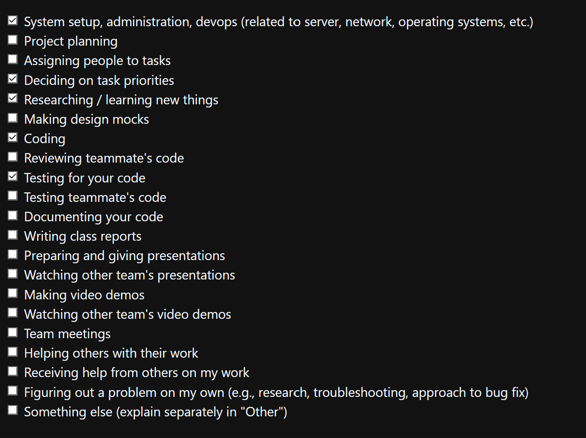

## Sunday (19th January 2025)

### Current Tasks
  * #1: Ratings Data Bug: QuestionID column is incorrect and broken, plus other changes
  * #2: Admin creds: Admin login is using harcoded data, should use the adminAPI for logging in
  * #3: Securing project: Use https for project

### Progress Update 
<table>
    <tr>
        <td><strong>TASK/ISSUE #</strong>
        </td>
        <td><strong>STATUS</strong>
        </td>
    </tr>
    <tr>
        <!-- Task/Issue # -->
        <td>#1: Ratings Data Bug
        </td>
        <!-- Status -->
        <td>Completed
        </td>
    </tr>
        <tr>
        <!-- Task/Issue # -->
        <td>#2: Admin creds
        </td>
        <!-- Status -->
        <td>Completed
        </td>
    </tr>
    <tr>
        <!-- Task/Issue # -->
        <td>#3: Securing project though HTTPS
        <!-- Status -->
        <td>In Progress
        </td>
    </tr>
        </table>

### Cycle Goal Review (Reflection: what went well, what was done, what didn't; Retrospective: how is the process going and why?)
I managed to get 2 important tasks completed but I think I spent a lot of time on task 3, with little success. Will need to talk to a TA and/or other groups on how they progressed with deployment.
### Next Cycle Goals (What are you going to accomplish during the next cycle)
  * Admin Privileges
  * User access
  * Deployment
### Team Evaulation Screenshot
