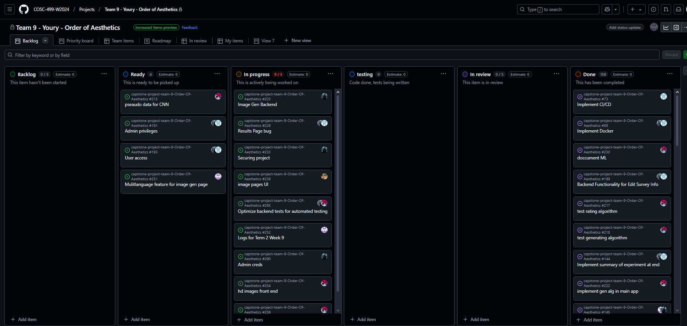

# Weekly Team Log

## Date Range:

- Week 7 - Week 9
- [16/2/2024] - [9/3/2025]

## Features in the Project Plan Cycle:

1.  Add Image generation page: Created a page in which users can see the generated images via the ML algorithm we created.
2. Add experiment summary/results page: Created a page in which users can see the results of their experiment, which images they picked, and how many users picked the same images (along with a percentage)
3. Added consent form page: Added a page where users can consent or not consent to participating after going through a pdf they havve to download.
4. Backend Functions: Various functions which allow us to fetch/insert data into the different databases have been created. Also various edit data functions have also been added to the backend functions.
5. Machine learning improvements: use a variety of mathematical & data science techniques should allow a much lower error with the CNN.
6. Improved UI and sidebar accessability: Sidebar has improved accessability. Additionally user and admin dashboard have been updated to look more appropriate. Fixed some UI bugs too.
7. Added and improved CI/CD: Added testing.yml, deploy.yml, and build.yml to improve on the CI/CD pippelines we have built.

## Associated Tasks from Project Board:

| Task ID | Description | Feature | Assigned To | Status |
| ------- | ----------- | ------- | ----------- | ------ |
| 73 | Improve CI/CD pipelines previously created | Improve CI/CD | [Devstutya] | [Complete] |
| 214 | Add a page/UI for generated images to be displayed | Image generation UI | [Devstutya] | [Complete] |
| 232 | Added updated system architecture diagram | Update system architecture diagram | [Devstutya] | [Complete] |
| 176 | Added experiment summary page or results page for users | Frontend for expSummary | [Devstutya] | [Complete] |
| 192 | Added exit button after experiment summary and on dashboard leading to homepage | Resetting application | [Devstutya] | [Complete] |
| 203 | Admin can view and delete survey info on the view survey data page | View and Edit/Remove survey info | [Devstutya] | [Complete] |
| 204 | Admin can export rating data to CSV and view on rating data page | Export Rating CSV | [Devstutya] | [Complete] |
| 207 | Improved UI and sidebar accessibility | Improve sidebar button accessibility | [Devstutya] | [Complete] |
| 30 | Expand preview.py to allow image rating | Prototype Python application | [Samira] | [Complete] |
| 31 | Proof of concept CNN | Prove neural nets usability | [Samira] | [Complete] |
| 31 | Update prototype app to start at non-zero image IDs | Update image ID handling | [Samira] | [Complete] |
| 47 | Add end-to-end tests | End-to-end testing | [Devstutya] | [Complete] |
| 227 | Fix QuestionID column and other issues | Ratings Data Bug | [Shakthi] | [Complete] |
| 260 | Use adminAPI for login instead of hardcoded data | Admin Creds | [Shakthi] | [Complete] |
| 234 | Secure project through HTTPS and certificates | Securing Project | [Shakthi] | [In Progress] |
| 92 | Ensure only users 18+ can access the survey | Age Restriction check | [Saketh] | [Complete] |
| 60 | Tune CNN parameters and iterations | Improve CNN | [Samira] | [Complete] |
| 61 | Implement alternative pre-train structures for CNN | Alternative CNN structures | [Samira] | [Complete] |
| 62 | Train/test split to check for overfitting | Data splitting | [Samira] | [Complete] |
| 63 | Graphs to verify optimization (tasks 60-62) | Visualization | [Samira] | [Complete] |
| 193 | Restrict experiment access until survey completion | User access | [Saketh] | [Completed] |
| 224 | API endpoint to update ratings for generated images | Image Gen Ratings | [Saketh] | [Completed] |
| 251 | Implement multilanguage feature for image gen page | Multilanguage Feature | [Saketh] | [In Progress] |
| 74 | Create readme.md for app directory | App Documentation | [Samira] | [Complete] |
| 97 | Create ML readme file | ML RM | [Samira] | [In Progress] |
| 98 | Prep data visualization | Visualizations | [Samira] | [Complete] |
| 106 | Create surrogate modeling data entries | Data generation | [Samira] | [Complete] |
| 107 | Train surrogate models using data | Model training | [Samira] | [Complete] |
| 108 | Save TensorFlow models | Model saving | [Samira] | [Complete] |
| 127 | Create testing framework for target group data | Test framework | [Samira] | [Complete] |
| 128 | Run tests and gather user data | Data collection | [Samira] | [Complete] |
| 129 | Document neural net functionality | NN documentation | [Samira] | [Complete] |
| 130 | Analyze and visualize data from tests | Data analysis | [Samira] | [Complete] |
| 131 | Prepare client questions | Client questions | [Samira] | [Complete] |
| 199 | Backend for editing survey info | Edit Survey Info | [Saketh] | [Complete] |
| 203 | Backend for removing survey data | Remove Survey Data | [Saketh] | [Complete] |
| 205 | Improve frontend for image aspect | Image Aspect | [Saketh] | [Complete] |
| 226 | Fix bugs on results page | Results Page Bug | [Saketh] | [In Progress] |
| 149 | Improve image quality | Image Quality | | |
| 150 | Fix data analysis in ML experiment | Data Analysis | | |
| 164 | Extract new images from PDFs | Image extraction | | |
| 165 | Restructure project repository | Repo restructuring | | |
| 181 | Gather VAST training data | VAST training data | [Samira] | [Complete] |
| 184 | Read and study CNN models | CNN study | [Samira] | [Complete] |
| 187 | Implement new image generation feature | Image Gen | [Samira] | [Complete] |
| 195 | Add seed for image generation | Image Gen seed | [Samira] | [Complete] |
| 197 | Fix averaging bug in data analysis | Averaging Bugfix | [Samira] | [Complete] |
| 235 | Implement double pixel smoothing | Pixel Smoothing | [Samira] | [Complete] |
| 236 | Enhance image quality with smoothing | Quality Smoothing | [Samira] | [Complete] |

## Tasks for Next Cycle:

| Task ID | Description                                                | Estimated Time (hrs) | Assigned To |
| ------- | ---------------------------------------------------------- | -------------------- | ----------- |
| [190]   | Proper session management | [6]                  | [Devsutya]  |
| [234]   | Securing Project                                           | [5]                  | [Shakthi]   |
| [193]   | User Access                                                | [4]                  | [Shakthi]   |
| [191]   | Admin Privileges                                           | [4]                  | [Shakthi]   |
| [251]   | Multilanguage feature for image gen                        | [4]                  | [Saketh]    |
| [193]   | User access                                                | [4]                  | [Saketh]    |
| [149]   | hd images front end                                        | [8]                 | [Samira]    |
| [214]   | image gen page vizuals                                               | [8]                  | [Samira]    |

### Alternatively, include image of the project board with tasks and status:

## Burn-up Chart (Velocity):

## Completed Tasks:

| Task ID | Description                                | Completed By |
| ------- | ------------------------------------------ | ------------ |
| [214]   | Image Generation UI               | [Devstutya]  |
| [73]   | Improve CI/CD            | [Devstutya]  |
| [232]   | Update system architecture diagram               | [Devstutya]  |
| [176]   | Frontend for experiment Summary               | [Devstutya]  |
| [192]   | Resetting application           | [Devstutya]  |
| [203]   | Edit/Remove survey data                     | [Devstutya]  |
| [204]   | Export csv of ratings                        | [Devstutya]  |
| [207]   | Improve UI andd sidebar accessibility      | [Devstutya]  |
| [227]    | Ratings Data Bug                          | [Shakthi]    |
| [260]    | Admin Creds                          | [Shakthi]    |
| [60]    | optimize CNN parameters                    | [Samira]     |
| [61]    | make a better Pre train process            | [Samira]     |
| [62]    | Check the CNN for overfit                  | [Samira]     |
| [63]    | plot ML paramiters                         | [Samira]     |
| [74]    | readme for app                             | [Samira]     |
| [92]    | Age Restriction check                      | [Saketh]     |
| [174]   | MultiLanguage Bug Fix                      | [Saketh]     |
| [115]   | Response Editing                           | [Saketh]     |
| [116]   | Experiment Summary                         | [Saketh]     |
| [109]   | Experiment Progress                        | [Saketh]     |
| [199]   | Backend Functionality for Edit Survey Info | [Saketh]     |
| [203]   | Edit/Remove Survey Data                    | [Saketh]     |
| [205]   | Image Aspect                               | [Saketh]     |
| [193]   | User access                                | [Saketh]    |
| [224]   | Image Gen Ratings                          | [Saketh]    |
| [226]   | Result Page Bug                             | [Saketh]    |
| [97]    | ML rm                                      | [Samira]     |
| [98]    | make vizualizations                        | [Samira]     |
| [106]   | create data                                | [Samira]     |
| [107]   | create models                              | [Samira]     |
| [108]   | save models                                | [Samira]     |
| [127]   | test framework                             | [Samira]     |
| [128]   | run tests                                  | [Samira]     |
| [129]   | document neural net                        | [Samira]     |
| [130]   | analysis & visualization                   | [Samira]     |
| [131]   | client questions                           | [Samira]     |
| [149]   | image quality                              | [Samira]     |
| [150]   | fix data analysis                          | [Samira]     |
| [164]   | new images from PDF                        | [Samira]     |
| [165]   | restructure repo                           | [Samira]     |
| [181]   | VAST training data                         | [Samira]     |
| [184]   | read CNN                                   | [Samira]     |
| [187]   | image generation                           | [Samira]     |
| [195]   | seed for img gen                           | [Samira]     |
| [197]   | averaging bug fix                          | [Samira]     |
| [254]   | quality smoothing                          | [Samira]     |
| [256]   | double pixel smoothing                     | [Samira]     |

## In Progress Tasks/ To do:

| Task ID | Description                     | Assigned To |
| ------- | ------------------------------- | ----------- |
| [190]   | Proper Session management       | [Devstutya] |
| [226]   | Results Page bug                | [Saketh]    |
| [251]   | Multilanguage feature for image gen page               | [Saketh]    |
| [193]   | User access                     | [Saketh]    |
| [234]   | Securing project                | [Shakthi]   |

## Test Report / Testing Status:

All tests for features added this sprint are passing.

## Overview:

Post-peer evaluation and M3, the team is now focused on improving and editing our work to more appropriately fit the needs of our client. Post M3 we aim to nullify any shortcomings we have had for M3, additionally now we will focus on M4 requirements as well. Now that we're in the final term for the project, we have a solid idea of what all is to be done in the next sprint. This week's features include updated UI, updated and new backend functionality, and implemented image generation algorithms. The Kanban Board has been populated with tasks and through this week more tasks will be added. The next cycle will focus on creating improvements for our webapp and nullifying shortcomings.
