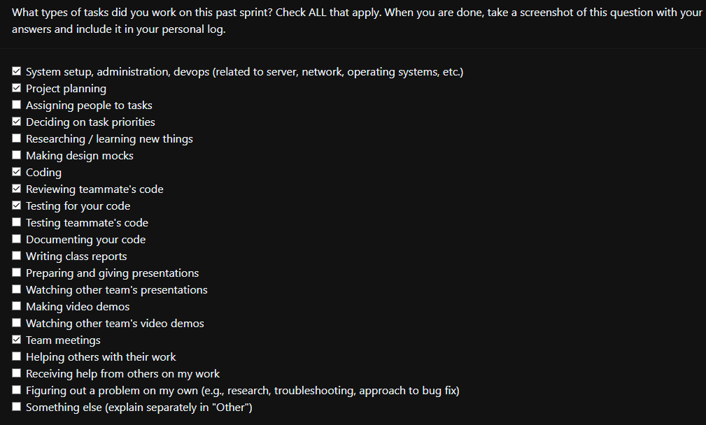

### Current Tasks
  * #1: Experiment Progress: Experiment progress is shown (e.g., how many questions remaining).
  * #2: Edit Rating Response: Users should be able to go back and edit their responses for image ratings, as long as they haven't submitted it.
  * #3: Experiment summary: At the end of the experiment, the use should be shown visual and data analytics on the images they chose.
  * #4: Multi Language Support: The application needs to have multilingual support in the infrastructure - demonstrate this with English and French in the app.

### Progress Update 
<table>
    <tr>
        <td><strong>TASK/ISSUE #</strong>
        </td>
        <td><strong>STATUS</strong>
        </td>
    </tr>
    <tr>
        <!-- Task/Issue # -->
        <td>#1: Experiment progress
        </td>
        <!-- Status -->
        <td>In progress
        </td>
    </tr>
    <tr>
        <!-- Task/Issue # -->
        <td>#2: Edit Rating Response
        </td>
        <!-- Status -->
        <td>In progress
        </td>
    </tr>
    <tr>
        <!-- Task/Issue # -->
        <td>#3:Experiment summary
        </td>
        <!-- Status -->
        <td>Completed
        </td>
    </tr>
        <tr>
        <!-- Task/Issue # -->
        <td>#4: Multi Language Support
        </td>
        <!-- Status -->
        <td>In progress
        </td>
    </tr>
</table>

### Cycle Goal Review (Reflection: what went well, what was done, what didn't; Retrospective: how is the process going and why?)
We have done most parts of all the primary 4 tasks related to the abckend. The reason for 1 and 2 not being marked as complete is becasue while we have the code running and tests pass, they heavily rely on the frontend being implemented and some other tasks. We expect the code to be fully mered with master in 24-48 hours though. Regarding task 4, we are having some trouble with a bug and will be asking for help to the TAs in class.

### Next Cycle Goals (What are you going to accomplish during the next cycle)
  * Add option for experimenter to choose upto 50 images to rate
  * Add session management to prevent privelege escalation of users.
  * Multilingual language support will be completed
  * All the 4 tasks will be merged with master after integrating with the frontend.
  * Might require an overhaul of project as there are unused files and file structure is weird.

