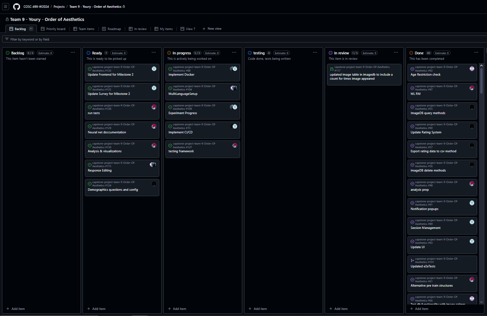
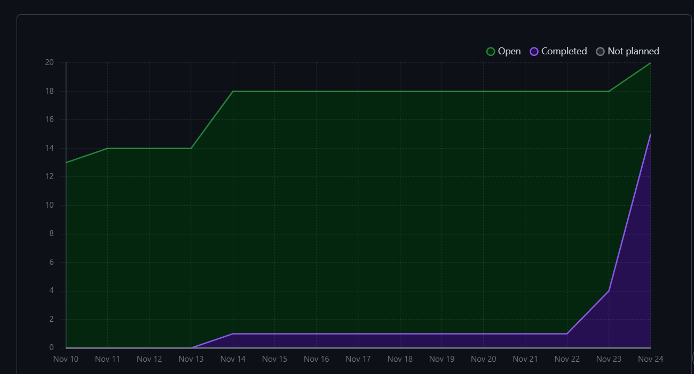

# Weekly Team Log

## Date Range:

- Week 9 - Week 12
- [3/11/2024] - [24/11/2024]

## Features in the Project Plan Cycle:

1. UI update: After Milestone 1 we knew what to update and where we had to improve, so I tried improving UI to more efficiently  suit the clients needs. Also added image comparision page.
2. Session Management: Created a state of admin being logged in or logged out using useState, and through this implemented session management where only admins can access admin functionality via their sidebar.
4. Backend Functions: Various functions which allow us to fetch/insert data into the different databases have been created. Also various edit data functions have also been added to the backend functions.
5. Machine learning improvements: use a variety of mathematical & data science techniques should allow a much lower error with the CNN.
6. [Add more here]

## Associated Tasks from Project Board:

| Task ID | Description        | Feature   | Assigned To | Status   |
| ------- | ------------------ | --------- | ----------- | -------- |
| 93 and 91| All the frontend in the webapp was updated, specifically sidebars and dashboards | Updated UI | [Devstutya]  | [Complete] |
| 93 | Updated image ratings to a page comparing images | Image comparision page  | [Devstutya]  | [Complete] |
| 89 | Implemented sign out and admin permissions to only allow admin to access admin features |  Session Management  | [Devstutya]  | [Complete] |
| 30  | Make a python file that expands on preview.py, so we can rate the images | Prototype Python application | [Samira]  | [Complete] |
| 31  | Prove that we can use neural nets this way | Proof of concept CNN | [Samira]  | [Complete] |
| 31  | Make the app start at image i'ds other then 0 | Append CSV in prototype app | [Samira]  | [Complete] |
| 47  | Add appropriate end to end tests | End to end testing | [Devstutya]  | [Complete] |
| 109 | Experiment Progress | Experiment progress is shown (e.g., how many questions remaining). | [Shakthi] | [In Progress] |
| 92  | Age Restriction check | Create a check to ensure only users who are 18+ can access the image survey | [Saketh]  | [Complete] |
| 55  | database query method | Database| [Zoe] | [Complete] |
| 56  | database delete method | Database| [Zoe] | [Complete] |
| 57  | export to csv method | Database| [Zoe]| [Complete] |
| 115  |  Edit Rating Response | Users should be able to go back and edit their responses for image ratings, as long as they haven't submitted it. | [Shakthi] | [In Progress] |
| 60  | Work on parameters & number of iterations to improve our CNN | Back End ML | [Samira]  | [Complete] |
| 61  | Implement alternative pre train structures to the CNN | Back End ML | [Samira]  | [Complete] |
| 62  | Train test split the data to check for over-fit with too many epoch's | Back End ML | [Samira]  | [Complete] |
| 63  | Make graphs of 60 61 & 62 to verify proper optimization | Back End ML | [Samira]  | [Complete] |
| 109  | Experiment Progress  | Experiment progress is shown (e.g., how many questions remaining).| [Saketh]  | [In Progress] |
| 104  | MulitLanguageSetup  | The application needs to have multilingual support in the infrastructure - demonstrate this with English and French in the app | [Saketh]  | [Complete] |
| 116  | Experiment summary | At the end of the experiment, the use should be shown visual and data analytics on the images they chose. | [Shakthi] | [Complete] |
| 73  | implement CI/CD | CI/CD | [Zoe] | [In progress] |
| 74  | Make a readme.md file for the app dir to keep up with new code | App Documentation | [Samira]  | [Complete] |
| 104  | Multi Language Support | Project needs multilingual support in the infrastructure - demonstrate this with English and French in the app. | [Shakthi] | [Complete] |
| 97  | ML RM | create a read me file | [Samira] | [In progress] |
| 98  | Make visualizations | prep for other bits of data being recorded | [Samira] | [Complete] |
| 106  | Make data | make data entries for surrogate modeling | [Samira] | [Complete] |
| 107  | Make model | use 106 to train surrogate models | [Samira] | [Complete] |
| 108  | Save models | save tensorflow models to be more deterministic | [Samira] | [Complete] |

## Tasks for Next Cycle:

| Task ID | Description        | Estimated Time (hrs) | Assigned To |
| ------- | ------------------ | -------------------- | ----------- |
| [126]   | Add frontend components for Milestone 2 requirements| [10]     | [Devsutya]  |
| [125]   | Update survey for milestone 2 with demographic questions, and extend the image comparsion page with more imagesets | [6]     | [Devsutya]  |
| [73]   | Implement CI/CD | [6] | [Zoe/Devstutya] |
| [56]   | imageDB delete methods | [4] | [Zoe] |
| [57]   | export rating data to csv| [4] | [Zoe] |
| [93]   | Update and enhance UI| [6]     | [Devsutya]  |
| [89]   | Session management | [4]     | [Devsutya]  |
| [91]   | Create pages for admin and user features and notifications | [6]     | [Devsutya]  |
| [73]   | Implement CI/CD | [6] | [Zoe] |
| [124]   | demographics questions/config | [4] | [Zoe] |
| [115]   | Response Editing | [2] | [Shakthi] |
| [109]   | Experiment Progress | [2] | [Shakthi] |
| [104]   | MultiLanguageSetup | [2] | [Shakthi] |
| [88]   | Implement docker| [4] | [Saketh]  |
| [115]   | Response Editing | [4] | [Saketh] |
| [116]   | Experiment Summary | [4] | [Saketh] |
| [127]   | testing framework | [4] | [Samira] |
| [128]   | run tests | [6] | [Samira] |
| [129]   | document CNN | [2] | [Samira] |
| [130]   | analyze & visualize | [4] | [Samira] |

### Alternatively, include image of the project board with tasks and status:

## Burn-up Chart (Velocity):

## Completed Tasks:

| Task ID | Description        | Completed By |
| ------- | ------------------ | ------------ |
| 93 and 91  | Updated UI| [Devstutya]  |
| 93 | Image comparision page |  [Devstutya]  | 
| 89 | Session Management |  [Devstutya]  | 
| [55]   | database query method | [Zoe] | 
| [56]   | Database delete method | [Zoe] |
| [57]   | export to csv method | [Zoe] | 
| 82 and 26  | Admin and User dashboards| [Devstutya]  |
| 87 | Image rating page |  [Devstutya]  | 
| 42 | Front end for user survey |  [Devstutya]  | 
| 117   | update ratings db | [Zoe] | 
|   | create image grouper method | [Zoe] |
|   | create json file for image grouper  | [Zoe] | 
| [116]   | Experiment summary| [Shakthi] |
| [60]   | optimize CNN parameters | [Samira] |
| [61]   | make a better Pre train process | [Samira] |
| [62]   | Check the CNN for overfit | [Samira] |
| [63]   | plot ML paramiters | [Samira] |
| [74]   | readme for app | [Samira] |
| [92]  | Age Restriction check | [Saketh]  |
| [97]   | ML rm | [Samira] |
| [98]   | make vizualizations | [Samira] |
| [106]   | create data | [Samira] |
| [107]   | create models | [Samira] |
| [108]   | save models | [Samira] |

## In Progress Tasks/ To do:

| Task ID | Description        | Assigned To |
| ------- | ------------------ | ----------- |
| [126]   | Add frontend components for Milestone 2 requirements  | [Devsutya]  |
| [125]   | Update survey and comparisions page  | [Devsutya]  |
| [73]   | implement CI/CD | [Zoe] |
| [124]   | create demographics questions and json config | [Zoe] |
| [115]   | Response Editing| [Shakthi] |
| [109]   | Experiment progress | [Shakthi] |
| [104]   | Multi Language Setup | [Shakthi] |
| [88]   | Implement docker | [Saketh] |
| [104]  | MulitLanguageSetup  |  [Saketh]  | 
| [115]   | Response Editing | [Saketh] |
| [116]   | Experiment Summary | [Saketh] |
| [109]  | Experiment Progress  | [Saketh]  |
| [127]   | testing framework | [4] | [Samira] |
| [128]   | run tests | [6] | [Samira] |
| [129]   | document CNN | [2] | [Samira] |
| [130]   | analyze & visualize | [4] | [Samira] |

## Test Report / Testing Status:

All tests for features added this sprint are passing.

## Overview:

This sprint the team focused on making progress for Milestone 2. Now that we're in the final stretch for M2 we have a solid idea of what all is to be done in the next week. This week's features include updated UI, updated and new backend functionality, and session management. We also have Samira working purely on the ML and she will have results by Milestone 2. Next, we will be working on implementing various features for these respective dashbpards keeping use cases in mind. The Kanban Board has been populated with tasks and through this week more tasks will eb added as we brainstorm for the Milestone 2. The next cycle will focus on finsihing up requirements for Milestone 2.
