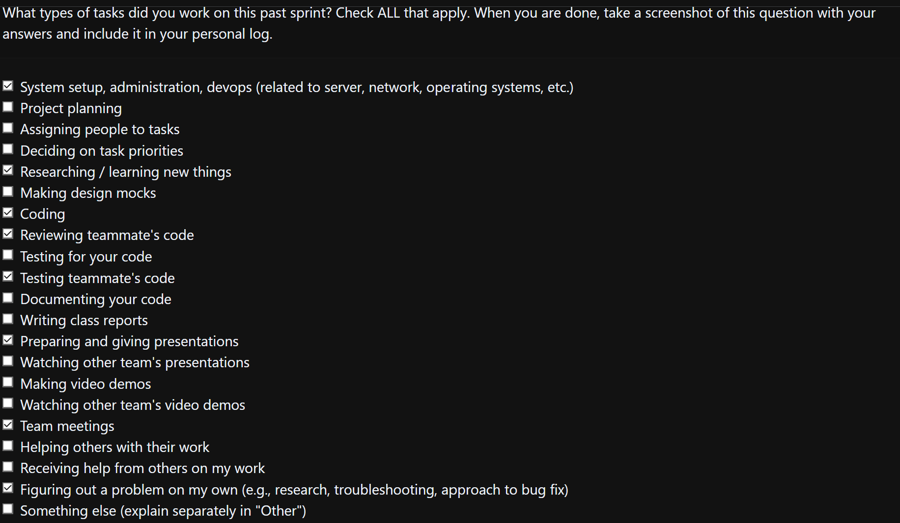

### Current Tasks
  * #1: Docker Intergration: The application needs to be dokerized.
  * #2: Experiment Progress Tracking: Need a feature to track number of questions answered.
  * #3 surveyAPI features: Update surveyAPI with additional features like deleting and getting survey data.

### Progress Update 
<table>
    <tr>
        <td><strong>TASK/ISSUE #</strong>
        </td>
        <td><strong>STATUS</strong>
        </td>
    </tr>
    <tr>
        <!-- Task/Issue # -->
        <td>#1: Docker Integration
        </td>
        <!-- Status -->
        <td>In progress
        </td>
    </tr>
    <tr>
        <!-- Task/Issue # -->
        <td>#2: Experiment Progress Tracking
        </td>
        <!-- Status -->
        <td>Completed
        </td>
    </tr>
    <tr>
        <!-- Task/Issue # -->
        <td>#3: Survey API features
        </td>
        <!-- Status -->
        <td>In Progress
        </td>
    </tr>
        </table>

### Cycle Goal Review (Reflection: what went well, what was done, what didn't; Retrospective: how is the process going and why?)
Docker has been a problem for a long time and I have managed to make big progess successfully. The build runs in under a minute, and the frontend container is working now. There is a small bug in backend container that I hope to clear soon. Technically, task 2 has been dropped as it has been overruled by another PR, but the code written previously served as a baseline. I am currently working on task 3 and will make a PR within 24-48 hours. Finals are coming close and I havent done as much work as previous iterations.
### Next Cycle Goals (What are you going to accomplish during the next cycle)
  * Update surveyAPI with additional features  like   deleting and getting survey data.
  * Remake tables in db as there are a few deprecated tables.
  * Might require an overhaul of project structure as there are unused files and file structure is weird.

