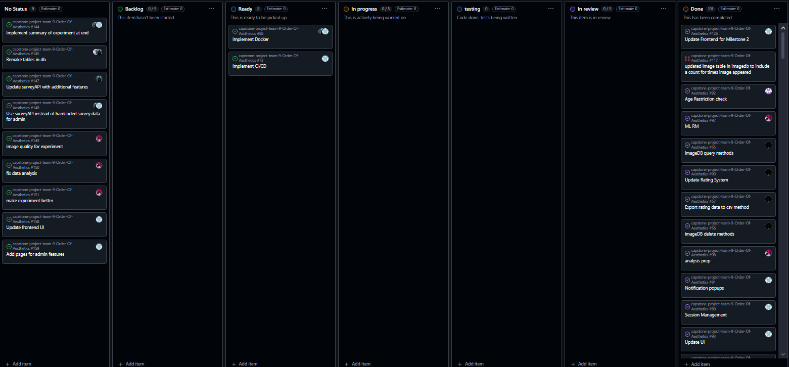
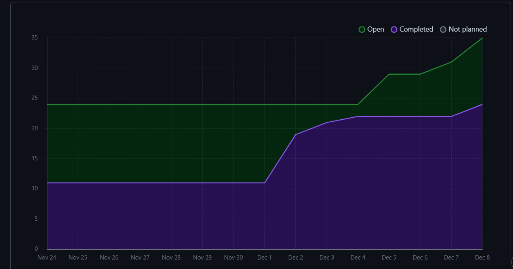

# Weekly Team Log

## Date Range:

- Week 12 - Week 14
- [24/11/2024] - [8/12/2024]

## Features in the Project Plan Cycle:

1. UI update:  After Milestone 1 we knew what to update and where we had to improve, so I tried improving UI to more efficiently  suit the clients needs. Updated UI and added a bunch of new pages through which we can expand our webapp's functionality.
2. Created new pages for new: Created a page where users can edit and update their survey information. Also, updated the rate-images page to now compare imagesets which include two images side by side of which one is picked by the user as the more aesthetic image. Added a question for parameters and added a rate-images quiz/experiment.
3. Backend Functions: Various functions which allow us to fetch/insert data into the different databases have been created. Also various edit data functions have also been added to the backend functions.
4. Machine learning improvements: use a variety of mathematical & data science techniques should allow a much lower error with the CNN.
5. [Add more here]

## Associated Tasks from Project Board:

| Task ID | Description        | Feature   | Assigned To | Status   |
| ------- | ------------------ | --------- | ----------- | -------- |
| 126| All the frontend in the webapp was updated, specifically sidebars and dashboards | Updated UI | [Devstutya]  | [Complete] |
| 125 | Updated image ratings to a page comparing images | Image comparision page  | [Devstutya]  | [Complete] |
| 157 | Created the experiment in rate-images page |  Create comparison quiz  | [Devstutya]  | [Complete] |
| 156 | Created edit-survey page where users edit their survey info |  Create edit-survey page  | [Devstutya]  | [Complete] |
| 30  | Make a python file that expands on preview.py, so we can rate the images | Prototype Python application | [Samira]  | [Complete] |
| 31  | Prove that we can use neural nets this way | Proof of concept CNN | [Samira]  | [Complete] |
| 31  | Make the app start at image i'ds other then 0 | Append CSV in prototype app | [Samira]  | [Complete] |
| 47  | Add appropriate end to end tests | End to end testing | [Devstutya]  | [Complete] |
| 109 | Experiment Progress Tracking | Experiment progress is shown (e.g., how many questions remaining). | [Shakthi] | [Complete] |
| 147 | SurveyAPI features | Update surveyAPI with additional features like deleting and getting survey data. | [Shakthi] | [In Progress] |
| 88  |  Docker Intergration |The application needs to be dockerized. | [Shakthi] | [In Progress] |
| 92  | Age Restriction check | Create a check to ensure only users who are 18+ can access the image survey | [Saketh]  | [Complete] |
| 60  | Work on parameters & number of iterations to improve our CNN | Back End ML | [Samira]  | [Complete] |
| 61  | Implement alternative pre train structures to the CNN | Back End ML | [Samira]  | [Complete] |
| 62  | Train test split the data to check for over-fit with too many epoch's | Back End ML | [Samira]  | [Complete] |
| 63  | Make graphs of 60 61 & 62 to verify proper optimization | Back End ML | [Samira]  | [Complete] |
| 109  | Experiment Progress  | Experiment progress is shown (e.g., how many questions remaining).| [Saketh]  | [In Progress] |
| 104  | MulitLanguageSetup  | The application needs to have multilingual support in the infrastructure - demonstrate this with English and French in the app | [Saketh]  | [Complete] |
| 74  | Make a readme.md file for the app dir to keep up with new code | App Documentation | [Samira]  | [Complete] |
| 97  | ML RM | create a read me file | [Samira] | [In progress] |
| 98  | Make visualizations | prep for other bits of data being recorded | [Samira] | [Complete] |
| 106  | Make data | make data entries for surrogate modeling | [Samira] | [Complete] |
| 107  | Make model | use 106 to train surrogate models | [Samira] | [Complete] |
| 108  | Save models | save tensorflow models to be more deterministic | [Samira] | [Complete] |
| 127  | Make a testing framework to gather data from each target group - see data directory | test framework | [Samira]  | [Complete] |
| 128  | Run the tests & gather the data from people | run tests | [Samira]  | [Complete] |
| 129  | document how the neural net works - existing rm is inadequate/out of date| NN documentation | [Samira]  | [Complete] |
| 130  | study the data from issue 128 | analysis & visualization | [Samira]  | [Complete] |
| 131  | make & document questions for the client | client questions | [Samira]  | [Complete] |
| 145  | Remake tables in db | backend | [Saketh]  | [In-Progress] |
| 144  | Implement summary of experiment at end | backend/frontend | [Saketh]  | [In-Progress] |
| 88  | Implement Docker | backend/frontend | [Saketh]  | [In-Progress] |

## Tasks for Next Cycle:

| Task ID | Description        | Estimated Time (hrs) | Assigned To |
| ------- | ------------------ | -------------------- | ----------- |
| [158]   | Update frontend components post Milestone 2| [10]     | [Devsutya]  |
| [159]   | Add pages for admin features| [8]     | [Devsutya]  |
| [73]   | Implement CI/CD | [6] | [Devstutya] |
| [91]   | Create pages for admin and user features and notifications | [6]     | [Devsutya]  |
| [145]   | Remake tables in DB | [2] | [Shakthi] |
| [144]   | Imlpement summary of experiment at end. | [4] | [Shakthi] |
| [88]   | Implement docker | [4] | [Shakthi] |
| [88]   | Implement docker| [4] | [Saketh]  |
| [145]   | Remake tables in db | [4] | [Saketh] |
| [144]   | Implement summary of experiment at end | [4] | [Saketh] |
| [149]   | Image quality | [12] | [Samira] |
| [150]   | fix data analysis | [4] | [Samira] |
| [151]   | improve experiment | [8] | [Samira] |

### Alternatively, include image of the project board with tasks and status:

## Burn-up Chart (Velocity):

## Completed Tasks:

| Task ID | Description        | Completed By |
| ------- | ------------------ | ------------ |
| 126| Updated UI | [Devstutya]  | [Complete] |
| 125 | Image comparision page  | [Devstutya]  | [Complete] |
| 157 | Create comparison quiz  | [Devstutya]  | [Complete] |
| 156 |   Create edit-survey page  | [Devstutya]  | [Complete] | 
| [109]   | Experiment Progress Tracking| [Shakthi] |
| [60]   | optimize CNN parameters | [Samira] |
| [61]   | make a better Pre train process | [Samira] |
| [62]   | Check the CNN for overfit | [Samira] |
| [63]   | plot ML paramiters | [Samira] |
| [74]   | readme for app | [Samira] |
| [92]  | Age Restriction check | [Saketh]  |
| [104]  | MulitLanguageSetup  |  [Saketh]  | 
| [115]   | Response Editing | [Saketh] |
| [116]   | Experiment Summary | [Saketh] |
| [109]  | Experiment Progress  | [Saketh]  ||
| [97]   | ML rm | [Samira] |
| [98]   | make vizualizations | [Samira] |
| [106]   | create data | [Samira] |
| [107]   | create models | [Samira] |
| [108]   | save models | [Samira] |
| [127]   | test framework | [Samira] |
| [128]   | run tests | [Samira] |
| [129]   | document neural net | [Samira] |
| [130]   | analysis & visualization | [Samira] |
| [131]   | client questions | [Samira] |

## In Progress Tasks/ To do:

| Task ID | Description        | Assigned To |
| ------- | ------------------ | ----------- |
| [158]   | Update frontend components post Milestone 2|  [Devsutya]  |
| [159]   | Add pages for admin features| [Devsutya]  |
| [73]   | Implement CI/CD |  [Devstutya] |
| [147]   | SurveyAPI features| [Shakthi] |
| [88]   | Implement docker | [Shakthi] |
| [88]   | Implement docker | [Saketh] |
| [144]   | Implement summary of experiment at end | [Saketh] |
| [145]   | Remake tables in db | [Saketh] |
| [149]   | Image quality | [12] | [Samira] |
| [150]   | fix data analysis | [4] | [Samira] |
| [151]   | improve experiment | [8] | [Samira] |

## Test Report / Testing Status:

All tests for features added this sprint are passing.

## Overview:

Post-Milestone 2, the team is now focused on improving and editing our work to more appropriately fit the needs of our client. Before M3 we aim to nullify any shortcomings we have had for M2, additionally now we will focus on M3 requirements as well. Now that we're in the final term for the project, we have a solid idea of what all is to be done in the next sprint. This week's features include updated UI, updated and new backend functionality, and session management. The Kanban Board has been populated with tasks and through this week more tasks will be added as we brainstorm for the Milestone 3. The next cycle will focus on creating improvements for our webapp, nullifying shortcomings, and Milestone 3 requirements.