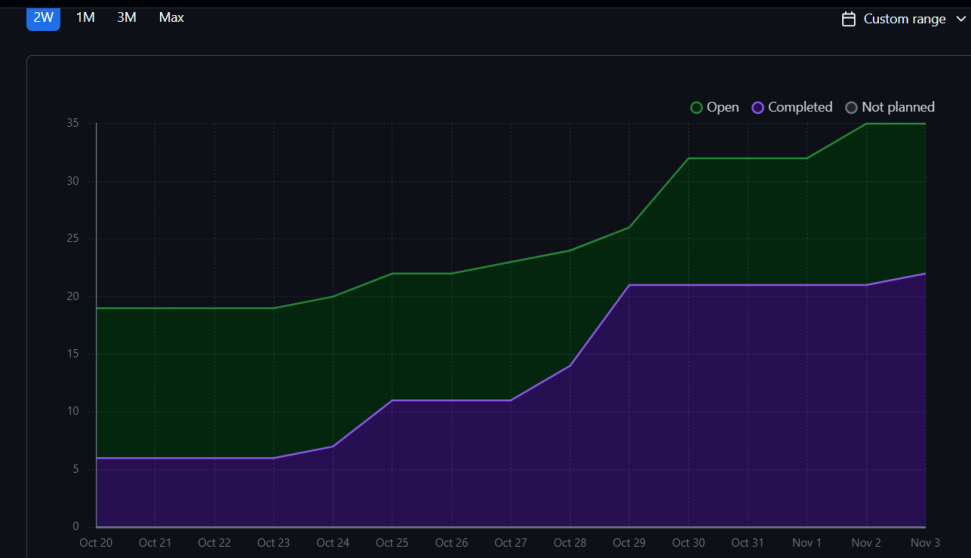

# Weekly Team Log

## Date Range:

- Week 7 - Week 9
- [21/10/2024] - [3/10/2024]

## Features in the Project Plan Cycle:

1. User and Admin Dashboards: Initial design for the dashboards, so that admin and user functionality can be accessed from the respective dashboards. These functions will be implemented starting next sprint.
2. Rating images: Created a page for rating images, which will be reworked to comparing images in imagesets.
3. User Survey: Created a page for user surveys which collects required user info and using our flask API the info is stored in our db.
4. Backend Functions: Various functions which allow us to fetch/insert data into the different databases have been created. Also various edit data functions have also been added to the backend functions.
5. Machine learning improvements: use a variety of mathematical & data science techniques should allow a much lower error with the CNN.
6. [Add more here]

## Associated Tasks from Project Board:

| Task ID | Description        | Feature   | Assigned To | Status   |
| ------- | ------------------ | --------- | ----------- | -------- |
| 82 and 26  | Admin and User dashboards | Admin and user dashboards page | [Devstutya]  | [Complete] |
| 87 | Image rating page | Rate/compare images  | [Devstutya]  | [Complete] |
| 42 | Front end for user survey | User survey page  | [Devstutya]  | [Complete] |
| 30  | Make a python file that expands on preview.py, so we can rate the images | Prototype Python application | [Samira]  | [Complete] |
| 31  | Prove that we can use neural nets this way | Proof of concept CNN | [Samira]  | [Complete] |
| 31  | Make the app start at image i'ds other then 0 | Append CSV in prototype app | [Samira]  | [Complete] |
| 47  | Add appropriate end to end tests | End to end testing | [Devstutya]  | [Complete] |
| 48  | Integrate Front-end and back-end | Integrate python backend and next.js frontend. | [Shakthi] | [Complete] |
| 48  | Integrate Front-end and back-end | Integrate python backend and next.js frontend | [Saketh]  | [Complete] |
| 55  | database query method | Database| [Zoe] | [Complete] |
| 56  | database delete method | Database| [Zoe] | [Complete] |
| 57  | export to csv method | Database| [Zoe]| [Complete] |
| 59  | Implement admin login functionality | Wrote the API for admin login. | [Shakthi] | [Complete] |
| 60  | Work on parameters & number of iterations to improve our CNN | Back End ML | [Samira]  | [Complete] |
| 61  | Implement alternative pre train structures to the CNN | Back End ML | [Samira]  | [Complete] |
| 62  | Train test split the data to check for over-fit with too many epoch's | Back End ML | [Samira]  | [Complete] |
| 63  | Make graphs of 60 61 & 62 to verify proper optimization | Back End ML | [Samira]  | [Complete] |
| 66  | Test db functionality with image ratings  | from the homepage verifying it via SQL. We will be using a random test image initially| [Saketh]  | [Complete] |
| 69  | Implement user survey functionality   | send user survey information to the SQLite db, and store it to be fetched| [Saketh]  | [Complete] |
| 70  | imageDB.py does not create a database |Added function to create a database with the schema. | [Shakthi] | [Complete] |
| 73  | implement CI/CD | CI/CD | [Zoe] | [In progress] |
| 74  | Make a readme.md file for the app dir to keep up with new code | App Documentation | [Samira]  | [Complete] |
| 88  | Implement Docker | We need to dockerize our project | [Shakthi] | [In progress] |
| 88  | Implement Docker | We need to dockerize our project | [Saketh] | [In progress] |

### Alternatively, include image of the project board with tasks and status:

## Tasks for Next Cycle:

| Task ID | Description        | Estimated Time (hrs) | Assigned To |
| ------- | ------------------ | -------------------- | ----------- |
| [93]   | Update and enhance UI| [6]     | [Devsutya]  |
| [89]   | Session management | [4]     | [Devsutya]  |
| [91]   | Create pages for admin and user features and notifications | [6]     | [Devsutya]  |
| [73]   | Implement CI/CD | [6] | [Zoe] |
| [56]   | imageDB delete methods | [4] | [Zoe] |
| [57]   | export rating data to csv| [4] | [Zoe] |
| [48]   | Add session management | [6] | [Shakthi] |
| [59]   | Only participants above 18 can do the ratings | [3] | [Shakthi] |
| [88]   | Implement docker | [4] | [Shakthi] |
| [92]   | Age Restriction check | [4] | [Saketh]  |
| [88]   | Implement docker | [4] | [Saketh] |
| [96]   | larger CNN sample size | [8] | [Samira] |
| [97]   | ML RM | [4] | [Samira] |
| [98]   | analysis prep | [4] | [Samira] |

### Alternatively, include image of the project board with tasks and status:

## Burn-up Chart (Velocity):

- Not required

## Completed Tasks:

| Task ID | Description        | Completed By |
| ------- | ------------------ | ------------ |
| 82 and 26  | Admin and User dashboards| [Devstutya]  |
| 87 | Image rating page |  [Devstutya]  | 
| 42 | Front end for user survey |  [Devstutya]  | 
| [55]   | database query method | [Zoe] | 
| [56]   | Database delete method | [Zoe] |
| [57]   | export to csv method | [Zoe] | 
| [48]   | FastAPI implementation | [Shakthi] |
| [60]   | optimize CNN parameters | [Samira] |
| [61]   | make a better Pre train process | [Samira] |
| [62]   | Check the CNN for overfit | [Samira] |
| [63]   | plot ML paramiters | [Samira] |
| [70]   | imageDB.py does not create a database | [Shakthi] |
| [74]   | readme for app | [Samira] |
| [59]   | Implement admin login functionality | [Shakthi] |
| [48]  | FastAPI implementation  | [Saketh]  | 
| [66]  | Test db functionality with image ratings  | [Saketh]  | 
| [69]  | Implement user survey functionality  | [Saketh]  |

## In Progress Tasks/ To do:

| Task ID | Description        | Assigned To |
| ------- | ------------------ | ----------- |
| [93]   | Update and enhance UI    | [Devsutya]  |
| [89]   | Session management     | [Devsutya]  |
| [91]   | Create pages for admin and user features and notifications | [Devsutya]  |
| [73]   | implement CI/CD | [Zoe] |
| [90]   | update ratings system in database | [Zoe] |
| [57]   | export rating data to csv|  [Zoe] |
| [88]   | Implement docker | [Shakthi] |
| [88]   | Implement docker | [Saketh] |
| [92]   | Age Restriction check | [Saketh]  |

## Test Report / Testing Status:

All tests for features added this sprint are passing.

## Overview:

The team focused on making progress in the first few major features of the webapp for the project. These features include Admin and user dashboards, and soon we will be working on implementing various features for these respective dashbpards keeping use cases in mind. The Kanban Board has been populated with tasks, milestones have been added, and the dashboard visuals creation has been completed. The next cycle will focus on adding incomplete features and working on the UI.
