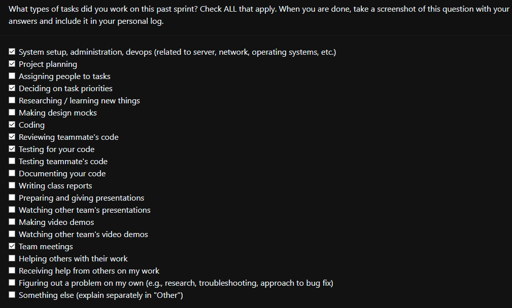

### Current Tasks
  * #1: Integrate Front-end and back-end (RestAPI): Research on best ways to integrate python backend and next.js frontend.
  * #2: Implement admin login functionality: My part of the issue was to write the API for admin login.
  * #3: imageDB.py does not create a database: A bug where the table schema is coded but no function was present to create a database with the schema.
  * #4: Implement Docker: We need to dockerize our project.

### Progress Update 
<table>
    <tr>
        <td><strong>TASK/ISSUE #</strong>
        </td>
        <td><strong>STATUS</strong>
        </td>
    </tr>
    <tr>
        <!-- Task/Issue # -->
        <td>#1: Integrate Front-end and back-end (RestAPI)
        </td>
        <!-- Status -->
        <td>Completed
        </td>
    </tr>
    <tr>
        <!-- Task/Issue # -->
        <td>#2: Implement admin login functionality
        </td>
        <!-- Status -->
        <td>Completed
        </td>
    </tr>
    <tr>
        <!-- Task/Issue # -->
        <td>#3: imageDB.py does not create a database
        </td>
        <!-- Status -->
        <td>Completed
        </td>
    </tr>
        <tr>
        <!-- Task/Issue # -->
        <td>#4: Implement Docker
        </td>
        <!-- Status -->
        <td>In progress
        </td>
    </tr>
</table>

### Cycle Goal Review (Reflection: what went well, what was done, what didn't; Retrospective: how is the process going and why?)
Tasks 1, 2 and 3 have been completed and merged with master. Docker has been throwing a lot of bugs and I recently managed to fix them and successfully dockerize the project. However,the project is not being run through the localhost link given by dockerand need to have a look at it.I hope this would be solved within 48 hours.

### Next Cycle Goals (What are you going to accomplish during the next cycle)
  * Change rating from a scale to picking one of two images.
  * Add session management to prevent privelege escalation of users.
  * Restrict minors from performing the rating.
  * UI needs more work
  * Might require an overhaul of project as there are unused files and file structure is weird.

