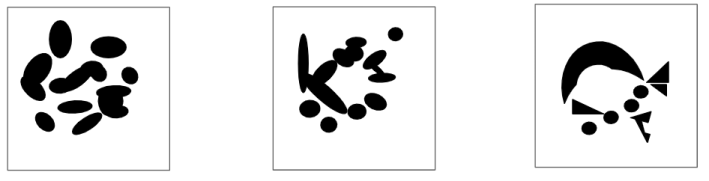

# Order of Aesthetics: Neural Network for Image Evaluation and Generation

This project explores how a neural network can both evaluate and generate images based on aesthetic quality. It is divided into two main parts:

1. **Training and Evaluating the Neural Network** (in `VASTCNNMain.py`)
2. **Generating Images via Gradient Ascent** (in `GenerateImagesPrototype.py`)

---

## 1. To rate images: Neural Network for Aesthetic Rating

### **Overview**

The goal of this part is to train a neural network that learns to predict an aesthetic score for a given image. These scores are based on user ratings collected from a dataset.

### **Algorithm Steps**

1. **Data Preparation:**

   * **Image Processing:**
     * Image resolution is stepped down to 32x32 pixels and colours normalized (all pixel values are scaled between 0 and 1)
     * The idea is by stepping down the image you can get a set of data small enough to convey info that matters to the ML model
   * **Rating Assignment:** Each image is paired with an average aesthetic rating derived from the app being run itself
2. **Building the Model:**

   * A convolutional neural network (CNN) is constructed, this is a way to detect trends from a set of data that wont neccesarily operate linearly
   * We feed this model a 1D pixel array - that is to say 1 pixel at a time - & reward the model the closer it gets to predicting what the average user thinks of a given image
3. **Training the Model:**

   * By now the network is trained to predict the aesthetic rating of images (henceforth the *Aesthetic Score*). It learns by comparing its predictions to the actual average ratings and adjusting itself accordingly until it gets soemthing desired
4. **Evaluating the Model:**

   * **Test Set Evaluation:** our model uses *Pairwise Comparison* -- since a model is trained on the average rating of a bunch of images, it is ill equiped to choose the more attractive between a pair of images, so our special evaluation compares pairs of images (labeled "L" for left and "R" for right) to see if the model correctly predicts which one is more aesthetically pleasing. Optimizing for discrete improvements over continuous data improoved our accuracy for the use case

### **Mathematical Metrics**

#### We used 2 primitive mathematical metrics to measure this first algorithm

1. **Mean Absolute Error (MAE):**

   This metric shows the average absolute difference between the predicted and actual ratings (the error on average if you will)

   \[MAE = \frac{1}{N} \sum_{i=1}^{N} \left(y_i - \hat{y}_i\right)^2\]
2. **Pairwise Prediction Accuracy:**

   This measures the percentage of correctly ordered image pairs. For each left/right pair, we check if the model predicts the left image as more aesthetic (or vice versa) as expected.
\
    \[Accuracy = Number of Correct Pair Predictions \div Total Number of Pairs \times 100\% )\]

#### And I used a third higher end method to test 3 Hypothesis

 - H1: Does *contrast* affect the aesthetic score?
 - H2: Does *shape* affect the aesthetic score?
 - H3: Does *symmetry* affect the aesthetic score?

I tested these 3 using manually generated images with large/little volumes of these attributes

The answers to which turned out:

The model had little to no preference for high or low contrast & little to no preference for high or low symmetry

However a high preference was indicated by returning a 10% higher aesthetic rating on average when the shape was defined less strictly

So while we refer to the null hypothesis's under H1 & H3 -- H2 tells us that the model & the users prefered smoother images over sharp ones

---

## 2. Image Generation via Gradient Ascent

### **Overview**

The second part of the project uses the trained model to generate new images. The idea is to start with a random image and then tweak it to make it more aesthetically appealing, as judged by the model.

### **Algorithm Steps (Non-Technical)**

1. **Load the Pre-Trained Model:**
   * The saved CNN is loaded from disk
2. **Initialize with Random Noise:**
   * A random image is generated. Think of it as a canvas filled with random colors as each pixel is random
3. **Optimize the Image:**
   * **Gradient Ascent:**

     The process involves repeatedly adjusting the image in small steps. In each step:

     * The model predicts the current aesthetic score of the image.
     * We calculate how to change the image to increase this score.
     * The image is updated accordingly.

   * **Color Quantization:**

     The image is reprocessed to limit it to a few distinct colors, giving it a smoother, more stylized look (in our case, 3 colours, B&W & Grey).
4. **Display/Save the Optimized Image:**
   * The final image, which has been optimized to achieve a higher aesthetic score, is either saved to disk or displayed directly

5. **Image smoothing:**
   * If you're very clever you'd have realized we are generating 32x32 images still - this is where smoothing comes in
   * By measuring the pixels surrounding each pixel - we can prune lone pixels & use that to gather a coherent image from the heavily optimized noise the neural net generated - thus giving us a final product

### **Can we do better?**

This is still a work in progress & strictly speaking all we've done is made a proof of concept as the data we're dealing with is too small in size to draw any real conclusions - but theoretically we could take the current model & improve it over time by getting users to play with reinforcement learning (getting them to rate images we make along the way to gradually optimize the algorithm) & generate a functional end product

---

### **Mathematical Metrics**

#### We used a simpler mathematical metric for this algorithm - just a back of the envelope survey:

image set:

5 users were asked to rate these images on a scale from 1 to 10:

- user 1: 8, 7, 6
- user 2: 9, 9, 8
- user 3: 8, 7, 9
- user 4: 7, 7, 9
- user 5: 10, 5, 7

Based on these averaged scores (8 / 10 plus or minus), we can see that the algorithm produces images that are generally perceived as visually appealing but not outstanding. This proof of concept demonstrates that with more training data & re enforcement, neural networks can reliably generate images at scale that meet a reasonable standard of aesthetic quality, setting the stage for further improvements and refinements to achieve even higher ratings down the line

---

## Conclusion

This project demonstrates a proof of concept where a neural network:

* Learns to evaluate images based on aesthetic quality.
* Can be used in reverse (via gradient ascent) to generate new, visually appealing images.
* Provides measurable performance metrics that help in understanding how well the model predicts and improves aesthetics.
